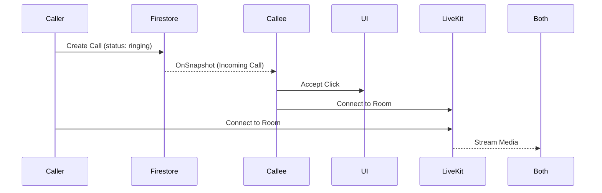

# Phase 4: Video Integration & Polish

**Timeline**: Weeks 7-10
**Focus**: WebRTC Video Calls, Screen Sharing, and Production Polish

## 1. Video Infrastructure (LiveKit/WebRTC)

### Tasks

- [x] **Provider Setup**: Set up LiveKit server (or cloud tier) or native WebRTC signaling.
- [x] **SDK Integration**: Install client SDKs.
- [x] **Call Context**: Create `CallProvider` to manage call state (ringing, connected, ended).

---

## 2. Video UI Components

### Tasks

- [x] **Call Controls**: Mute Audio, Mute Video, End Call, Screen Share buttons.
- [x] **Video Grid**: Responsive grid to show participants.
  - 1-on-1: Large view.
  - Group: Grid view.
- [x] **Incoming Call Modal**: Popup when receiving a call request.

### Testing Strategy

- **Test**: Call controls toggle state (mute/unmute).
- **Test**: Video grid renders correct number of participant tiles.

---

## 3. 1-on-1 Video Calls

### Tasks

- [x] **Signaling**:
  - User A clicks "Video Call".
  - Create `Call` document in Firestore.
  - Notify User B (via real-time listener).
- [x] **Connection**:
  - Exchange SDP/ICE candidates (if native) or connect to Room (if LiveKit).
- [x] **Media Handling**: Attach local and remote streams to `<video>` elements.

---

## 4. Screen Sharing

### Tasks

- [x] **Capture**: Use `navigator.mediaDevices.getDisplayMedia`.
- [x] **Track Replacement**: Replace video track with screen track.
- [x] **UI**: Indicator that "You are sharing your screen".

---

## 5. Polish & Deployment (Phase 5 Scope)

### Tasks

- [ ] **Performance**:
  - Implement code splitting (React.lazy).
  - Optimize image loading.
- [ ] **PWA**: Add `manifest.json` and Service Workers for offline support.
- [ ] **Accessibility**: Audit with Lighthouse (Aria labels, contrast).
- [ ] **CI/CD**:
  - Setup GitHub Actions for testing.
  - Configure Vercel for auto-deployment.

### Testing Strategy

- **E2E Testing**: Use Cypress or Playwright for full flow (Login -> Chat -> Call).
- **Unit**: Achieve >80% coverage on utility functions.

---

## Phase 4 Deliverables

- ✅ Fully functional 1-on-1 video calling.
- ✅ Screen sharing capabilities.
- ✅ Call notifications/ringing UI.
- ✅ Production-ready build.
- ✅ CI/CD Pipeline.

## Final Architecture Review

### Video Flow

### Deployment Checklist

- [ ] Environment variables set in Vercel.
- [ ] Firestore indexes deployed.
- [ ] Storage CORS configured.
- [ ] Domain connected.
