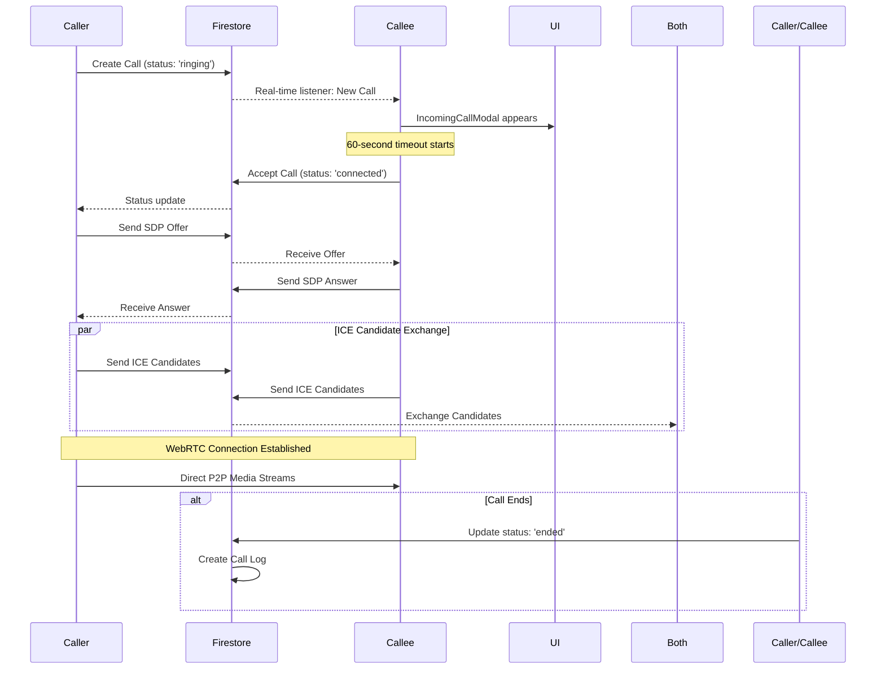

# Phase 4: Video Integration & Polish

**Timeline**: Weeks 7-10
**Focus**: WebRTC Video Calls, Screen Sharing, and Production Polish

## 1. Video Infrastructure (Native WebRTC)

### Tasks

- [x] **WebRTC Setup**: Implemented native WebRTC with Google STUN servers for NAT traversal.
- [x] **Signaling**: Firestore-based signaling for SDP offers/answers and ICE candidates.
- [x] **Call Context**: Created `CallProvider` to manage call state (idle, calling, ringing, connected, ended, rejected).
- [x] **Call Types**: Support for video and audio-only calls via `mediaType` parameter.

### Implementation Details

- **RTCPeerConnection**: Creates peer-to-peer connections with ICE servers.
- **Media Constraints**: Configurable audio (with echo cancellation, noise suppression) and video (1280x720).
- **Auto-timeout**: Calls automatically cancelled after 60 seconds if not answered.
- **Services**:
  - `callService.ts`: Firestore CRUD operations for calls and signaling.
  - `useVideoCall.ts`: Custom hook managing WebRTC lifecycle, media streams, and peer connections.

---

## 2. Video UI Components

### Tasks

- [x] **Call Controls** (`CallControls.tsx`):
  - Toggle audio (mute/unmute microphone).
  - Toggle video (camera on/off).
  - Toggle screen sharing.
  - End call button.
  - Dynamic controls: audio-only calls hide video/screen share buttons.
- [x] **Video Display** (`VideoCallModal.tsx`):
  - Picture-in-picture layout for 1-on-1 calls.
  - Remote stream: Full-screen video view.
  - Local stream: Small corner preview (mirrored).
  - Fallback avatars when video is disabled.
  - Connection status indicators.
- [x] **Incoming Call Modal** (`IncomingCallModal.tsx`):
  - Real-time call notification with caller info and avatar.
  - Visual timer (60-second countdown).
  - Accept/Reject buttons.
  - Auto-reject on timeout.
  - Animated visual effects (pulse, bounce).

### Testing Strategy

- **Test**: Call controls toggle state correctly (mute/unmute audio & video).
- **Test**: Screen sharing replaces video track and displays indicator.
- **Test**: Incoming call modal displays and auto-dismisses after 60 seconds.
- **Test**: Audio-only calls hide video controls appropriately.

---

## 3. 1-on-1 Video & Audio Calls

### Tasks

- [x] **Call Initiation**:
  - Integrated call buttons in ChatRoom for direct messages.
  - Support for both video and audio-only calls.
  - Call document created in Firestore with status 'ringing'.
- [x] **Signaling Flow**:
  - Caller creates offer (SDP) and sends via Firestore.
  - Callee receives real-time notification via `subscribeToIncomingCalls`.
  - Callee accepts and creates answer (SDP).
  - ICE candidates exchanged through Firestore collection.
  - Connection established with queue system for early ICE candidates.
- [x] **Media Handling**:
  - Local stream captured and displayed in video element.
  - Remote stream received via `ontrack` event and rendered.
  - Track state monitoring for video enable/disable detection.
  - Proper cleanup on call end (stop tracks, close peer connection).
- [x] **Call States**:
  - `idle`: No active call.
  - `calling`: Initiating call.
  - `ringing`: Call sent, waiting for answer.
  - `connected`: Active call in progress.
  - `ended`: Call completed normally.
  - `rejected`: Call declined or missed.

---

## 4. Screen Sharing

### Tasks

- [x] **Capture**: Implemented `navigator.mediaDevices.getDisplayMedia` for screen capture.
- [x] **Track Replacement**:
  - Original video track saved in ref.
  - `RTCRtpSender.replaceTrack()` used to swap camera with screen.
  - Local stream updated to reflect screen sharing.
- [x] **UI**:
  - Screen share button in CallControls (blue when active).
  - Automatic cleanup when user stops sharing via browser UI.
  - Toggle to restore camera feed.
- [x] **Limitations**:
  - Screen sharing only available in video calls.
  - Audio from screen not captured (display media with audio: false).

---

## 5. Call History & Logging

### Tasks

- [x] **Call Logs** (`callHistoryService.ts`):
  - Automatic logging of all call attempts.
  - Tracks: caller/callee info, duration, outcome, media type.
  - Call outcomes: completed, missed, rejected, no-answer, cancelled.
- [x] **Call History Page** (`CallHistory.tsx`):
  - List view of all calls (incoming/outgoing).
  - Filter by: all, incoming, outgoing, missed.
  - Visual indicators: call direction icons, duration, timestamp.
  - Formatted timestamps (Today, Yesterday, etc.).
- [x] **Call Log UI** (`CallLogItem.tsx`):
  - Compact display in chat rooms or history.
  - Icons for call type (audio/video) and direction.
  - Color-coded outcomes (green=answered, red=missed).

---

## 6. Polish & Deployment

### Completed

- [x] **Version Control**: Git with pre-commit hooks (Husky + lint-staged).
- [x] **Code Quality**: ESLint + Prettier configured and enforced.
- [x] **Deployment**:
  - Vercel configuration (`vercel.json`) with SPA routing.
  - Firebase configuration for Firestore, Storage, and Authentication.
  - Environment variable setup (`.env.example`).

### Remaining (Future Enhancements)

See [Phase 5: Polish, Testing & Advanced Features](./PHASE_5_POLISH.md) for:

- Performance optimizations (code splitting, lazy loading)
- PWA support (manifest, service workers, push notifications)
- Accessibility enhancements (WCAG 2.1 AA compliance)
- CI/CD pipeline implementation
- Group video calls
- E2E testing framework

### Testing Strategy

- **Manual Testing**: Login -> Browse Users -> Initiate Call -> Accept/Reject -> Call History.
- **Browser Testing**: Tested on Chrome, Edge (WebRTC compatibility).
- **Future**: E2E testing framework and unit test coverage >80%.

---

## Phase 4 Deliverables

### ✅ Completed

- **1-on-1 Video Calling**: Full WebRTC implementation with offer/answer/ICE signaling.
- **1-on-1 Audio Calling**: Audio-only mode with appropriate UI adaptations.
- **Screen Sharing**: Track replacement with user-initiated start/stop.
- **Call Notifications**: Real-time incoming call modal with timeout.
- **Call History**: Complete logging system with filterable history page.
- **Call Controls**: Mute/unmute audio, video toggle, screen share, end call.
- **Responsive UI**: Dark mode support, mobile-friendly layouts.
- **Auto-cleanup**: Automatic call timeout after 60 seconds.
- **Production Build**: Vite-optimized bundle ready for deployment.
- **Vercel Deployment**: Configured with proper SPA routing.

### 🚧 Partial / Future Work

- **Group Video Calls**: Types defined but implementation pending.
- **PWA Features**: Manifest and service workers not yet implemented.
- **CI/CD Pipeline**: GitHub Actions workflow not configured.
- **Accessibility**: Basic implementation, full audit pending.
- **Performance**: Code splitting and optimization deferred.
- **E2E Testing**: Test framework not yet set up.

## Architecture & Technical Details

### WebRTC Call Flow


```mermaid
sequenceDiagram
    participant Caller
    participant Firestore
    participant Callee

    Caller->>Firestore: Create Call (status: 'ringing')
    Firestore-->>Callee: Real-time listener: New Call
    Callee->>UI: IncomingCallModal appears
    Note over Callee: 60-second timeout starts
    Callee->>Firestore: Accept Call (status: 'connected')
    Firestore-->>Caller: Status update
    Caller->>Firestore: Send SDP Offer
    Firestore-->>Callee: Receive Offer
    Callee->>Firestore: Send SDP Answer
    Firestore-->>Caller: Receive Answer

    par ICE Candidate Exchange
        Caller->>Firestore: Send ICE Candidates
        Callee->>Firestore: Send ICE Candidates
        Firestore-->>Both: Exchange Candidates
    end

    Note over Caller,Callee: WebRTC Connection Established
    Caller->>Callee: Direct P2P Media Streams

    alt Call Ends
        Caller/Callee->>Firestore: Update status: 'ended'
        Firestore->>Firestore: Create Call Log
    end
```

### Key Components

**Context Providers:**

- `CallContext` (`context/CallContext.tsx`): Manages call lifecycle, incoming calls, active call state.

**Custom Hooks:**

- `useVideoCall` (`hooks/useVideoCall.ts`): WebRTC connection, media streams, peer connection management.
- `useAuth`: User authentication and profile data.

**Services:**

- `callService.ts`: CRUD operations for calls and signaling data in Firestore.
- `callHistoryService.ts`: Call log creation and retrieval.

**Components:**

- `VideoCallModal`: Main call interface with video streams.
- `IncomingCallModal`: Call notification with accept/reject.
- `CallControls`: Media control buttons.
- `CallHistory`: Historical call log viewer.

### Firestore Collections

```typescript
// /calls/{callId}
{
  roomId: string,
  callerId: string,
  callerName: string,
  callerAvatar?: string,
  calleeId: string,
  calleeName: string,
  calleeAvatar?: string,
  type: '1-on-1' | 'group',
  mediaType: 'audio' | 'video',
  status: 'idle' | 'calling' | 'ringing' | 'connected' | 'ended' | 'rejected',
  createdAt: Timestamp,
  startedAt?: Timestamp,
  endedAt?: Timestamp
}

// /calls/{callId}/signals/{signalId}
{
  callId: string,
  senderId: string,
  receiverId: string,
  type: 'offer' | 'answer' | 'ice-candidate',
  offer?: { sdp: string, type: 'offer' },
  answer?: { sdp: string, type: 'answer' },
  iceCandidate?: { candidate: string, sdpMid: string, sdpMLineIndex: number },
  createdAt: Timestamp
}

// /callLogs/{logId}
{
  callId: string,
  roomId: string,
  callerId: string,
  callerName: string,
  calleeId: string,
  calleeName: string,
  mediaType: 'audio' | 'video',
  direction: 'incoming' | 'outgoing', // relative to user
  outcome: 'completed' | 'missed' | 'rejected' | 'no-answer' | 'cancelled',
  duration?: number, // seconds
  timestamp: Timestamp,
  createdAt: Timestamp
}
```

### Deployment Checklist

- [x] Environment variables configured (`.env.local` and Vercel).
- [x] Firebase project setup (Authentication, Firestore, Storage).
- [x] Firestore security rules deployed.
- [x] Firestore indexes deployed.
- [x] Storage CORS configured.
- [x] Vercel project connected and deployed.
- [ ] Custom domain connected (optional).
- [ ] GitHub Actions CI/CD (pending).

---

## Browser Compatibility

### Supported Browsers

| Browser       | Video Calls | Audio Calls | Screen Share | Notes                             |
| ------------- | ----------- | ----------- | ------------ | --------------------------------- |
| Chrome 90+    | ✅          | ✅          | ✅           | Full support, recommended         |
| Edge 90+      | ✅          | ✅          | ✅           | Chromium-based, full support      |
| Firefox 78+   | ✅          | ✅          | ✅           | Full support                      |
| Safari 14+    | ✅          | ✅          | ⚠️           | Screen share may have limitations |
| Mobile Chrome | ✅          | ✅          | ❌           | No screen share on mobile         |
| Mobile Safari | ✅          | ✅          | ❌           | No screen share on mobile         |

### Requirements

- **HTTPS**: WebRTC requires secure context (localhost or HTTPS).
- **Permissions**: Users must grant camera/microphone access.
- **Firewall**: May require STUN/TURN server for restrictive networks.

---

## Known Issues & Limitations

### Current Limitations

1. **Group Calls**: Not implemented yet. Types defined but no multi-peer support.
2. **TURN Servers**: Only STUN servers configured. Calls may fail on restrictive networks.
3. **Call Recording**: Not implemented.
4. **Call Transfer**: Not implemented.
5. **Mobile Optimization**: UI works but could be further optimized for mobile devices.
6. **Bandwidth Adaptation**: No dynamic quality adjustment based on network conditions.

### Known Issues

- **ICE Candidate Race**: Early ICE candidates are queued but may cause brief connection delays.
- **Signal Cleanup**: Firestore signals collection grows over time (no automatic cleanup).
- **Reconnection**: No automatic reconnection if network drops during call.
- **Multiple Devices**: User logged in on multiple devices may receive duplicate call notifications.

### Workarounds

- **Restrictive Networks**: Consider adding TURN server (e.g., Twilio, Xirsys) for production.
- **Signal Cleanup**: Implement periodic cleanup job or TTL on signals.
- **Multiple Devices**: Future improvement to handle device-specific notifications.

---

## Next Steps

Phase 4 video calling implementation is complete. For future enhancements and production readiness, see **[Phase 5: Polish, Testing & Advanced Features](./PHASE_5_POLISH.md)**, which covers:

### Phase 5 Priorities

1. **CI/CD Pipeline**: GitHub Actions workflow for automated testing and deployment.
2. **Comprehensive Testing**: Unit, integration, and E2E tests with >80% coverage.
3. **PWA Support**: Service worker, push notifications, and offline functionality.
4. **Performance**: Code splitting, lazy loading, and bundle optimization.
5. **Accessibility**: WCAG 2.1 AA compliance and keyboard navigation.
6. **Group Video Calls**: Multi-participant support with SFU architecture.

Refer to the [Phase 5 documentation](./PHASE_5_POLISH.md) for detailed implementation plans.

---

## Testing Recommendations

### Manual Testing Checklist

- [ ] Start video call from ChatRoom.
- [ ] Start audio call from ChatRoom.
- [ ] Accept incoming call.
- [ ] Reject incoming call.
- [ ] Call times out after 60 seconds.
- [ ] Mute/unmute audio during call.
- [ ] Turn video on/off during call.
- [ ] Share screen (desktop only).
- [ ] Stop screen sharing.
- [ ] End call properly.
- [ ] Check call appears in Call History.
- [ ] Filter call history (all, incoming, outgoing, missed).
- [ ] Dark mode displays correctly.
- [ ] Mobile responsive layout works.

### Automated Testing (Future)

```typescript
// Example E2E test structure
describe('Video Call Flow', () => {
  it('should initiate and accept a video call', () => {
    // User A logs in
    // User A navigates to ChatRoom
    // User A clicks video call button
    // User B (in another session) receives notification
    // User B accepts call
    // Verify video streams are active
    // User A ends call
    // Verify call log created
  });
});
```

---

## Resources & Documentation

### Internal Documentation

- [Firebase Setup](../FIREBASE_SETUP.md)
- [Development Journal](../DEVELOPMENT_JOURNAL.md)
- [Project Specification](../SPEC.md)
- [V2 Roadmap](../V2_ROADMAP.md)

### External References

- [WebRTC API Documentation](https://developer.mozilla.org/en-US/docs/Web/API/WebRTC_API)
- [RTCPeerConnection Guide](https://developer.mozilla.org/en-US/docs/Web/API/RTCPeerConnection)
- [getDisplayMedia API](https://developer.mozilla.org/en-US/docs/Web/API/MediaDevices/getDisplayMedia)
- [Firebase Firestore](https://firebase.google.com/docs/firestore)
- [Vercel Deployment](https://vercel.com/docs)

---

## Conclusion

Phase 4 has successfully implemented a robust WebRTC-based video calling system with the following highlights:

✅ **Fully functional 1-on-1 video and audio calls**  
✅ **Screen sharing with seamless track switching**  
✅ **Real-time call notifications and management**  
✅ **Comprehensive call history and logging**  
✅ **Production-ready deployment on Vercel**

The foundation is solid for future enhancements including group calls, PWA features, and advanced optimizations. The native WebRTC implementation provides flexibility and control, while Firebase handles signaling and state management effectively.

**Status**: Phase 4 Core Features **COMPLETE** ✓  
**Next**: [Phase 5 - Polish, Testing & Advanced Features](./PHASE_5_POLISH.md)
